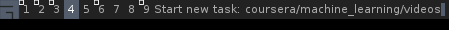

============
Introduction
============

Awesome Time Tracking tool for awesome window manager.

1. Using Awesome WM **prompt** widget You are able to rapidly enter the task
   You're currently working on [#f1]_.

2. Reports are powered by Qmonix analytics SDK, so this gives us nice charts
   and allows us to collect/store our task data with no hustle.

.. image:: res/image/qmonix.png

Dependencies
============

1. Qmonix Lua SDK [#f3]_. To retrieve it simply type in Your terminal:

.. code-block:: bash

        $ git submodule update --init

Installation
============

Qmonix
------

First of all You must install Qmonix [#f2]_ server on Your local or remote
machine. It is explained in here
http://docs.qmonix.com/latest/installation/index.html.

Awesome Time Tracker
--------------------

.. code-block:: bash

        $ make build
        $ make install

will build and install Awesome Time Tracker to **~/.config/awesome** by default.
To change installation dir, specify variable **INSTALL_PATH** before invoking
**make install**:

.. code-block:: bash

        $ INSTALL_PATH="/etc/xdg/awesome" make install

I suggest You to provide **INSTALL_PATH** directory where **rc.lua** is located.

When You have installed time tracker files to the right location, let's
enable some conveniences key bindings in Awesome WM. We'll be using to
key bindings:

1. ctrl+modkey+a - displays the prompt widget where You can type the
   name of new task/activity.
2. ctrl+modkey+s - stops the task, if one was started. At this point task
   duration event is sent to Qmonix server.

.. info::

        Comment in Awesome WM config file rc.lua:

        -- Default modkey.
        -- Usually, Mod4 is the key with a logo between Control and Alt.

You must modify Your **rc.lua** config file to enable new key bindings:

.. code-block:: lua

        local awesome_time_tracker = require "time_tracker"
        local time_tracker = awesome_time_tracker.create("http://localhost:8337")
        function time_tracker_set_activity(activity)
                time_tracker:set_activity(activity)
        end

        globalkeys = awful.util.table.join(
                ...

                awful.key({modkey, "Control"}, "s", function () time_tracker:stop_current_activity()   end),
                awful.key({ modkey, "Control" }, "a",
                        function ()
                                awful.prompt.run({ prompt = "Start new task: " },
                                mypromptbox[mouse.screen].widget,
                                time_tracker_set_activity, nil,
                                awful.util.getdir("cache") .. "/history_eval")
                        end),

               ...
       )

That's it. Restart Your Awesome WM to apply the config changes and You should
be all set.

To test if everything works fine, press **ctrl+modkey+a** and You should
be prompted with "Start new task:". Press **ctrl+modkey+s** and open
**http://localhost:8337** in Your Web browser. Now You should be able
to find Your tasks in Qmonix dashboard.

.. rubric:: References

.. [#f1] http://awesome.naquadah.org/doc/api/modules/awful.widget.prompt.html
.. [#f2] http://qmonix.com
.. [#f3] https://github.com/qmonix/client-lua
